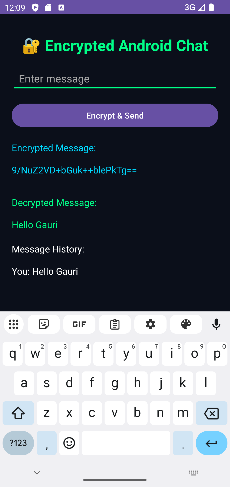

# 🔐 Syntecxhub Encrypted Android Chat

<p align="center">
  
</p>

<p align="center">
  <b>A secure Android chat prototype built using Java, XML, Android Studio, and AES encryption.</b>
</p>

<p align="center">
  🔐 AES Encryption • 📱 Android Studio • ☕ Java • 🛡️ Cybersecurity Project • 💬 Secure Messaging
</p>

---

## 📌 Project Overview

**Syntecxhub Encrypted Android Chat** is a cybersecurity-based Android application that demonstrates how messages can be encrypted and decrypted locally using AES encryption.

The app allows users to enter a message, encrypt it, decrypt it back, and view the message history inside a clean Android interface.

This project was created as part of the **Syntecxhub Cyber Security Internship Task**.

---

## ✨ Features

* 🔐 AES-based message encryption
* 🔓 Local message decryption
* 💬 Simple chat-style message input
* 📜 Message history display
* 🎨 Dark cyber-themed Android UI
* ⚠️ Basic error handling
* 📱 Runs on Android Emulator
* ☕ Built using Java and XML

---

## 🛠️ Technologies Used

| Technology     | Purpose                           |
| -------------- | --------------------------------- |
| Java           | App logic and encryption handling |
| XML            | Android UI design                 |
| Android Studio | Development environment           |
| AES Algorithm  | Message encryption and decryption |
| Gradle         | Android project build system      |

---

## 📂 Project Structure

```bash
Syntecxhub_Encrypted_Android_Chat/
│
├── app/
│   └── src/
│       └── main/
│           ├── java/
│           │   └── com/example/syntecxhub_encrypted_android_chat/
│           │       ├── MainActivity.java
│           │       └── AESHelper.java
│           │
│           └── res/
│               └── layout/
│                   └── activity_main.xml
│
├── assets/
│   └── screenshots/
│       └── Screenshot_20260529_121006.png
│
├── build.gradle.kts
├── settings.gradle.kts
├── gradle.properties
└── README.md
```

---

## 🔐 How Encryption Works

1. User enters a message.
2. The app encrypts the message using AES.
3. The encrypted message is displayed on the screen.
4. The encrypted text is decrypted locally.
5. The original message is shown again as decrypted output.
6. The message is added to message history.

---

## 📱 App Preview

<p align="center">
  
</p>

---

## 🚀 How to Run

### Step 1: Clone the Repository

```bash
git clone https://github.com/GauriSomwanshi29/Syntecxhub_Encrypted_Android_Chat.git
```

### Step 2: Open in Android Studio

Open Android Studio and select:

```bash
Open Project
```

Then choose the project folder.

### Step 3: Sync Gradle

Wait until Gradle sync completes.

### Step 4: Run Emulator

Create or select an Android Virtual Device.

Example:

```bash
Pixel 4 API 34
```

### Step 5: Run the App

Click the green run button:

```bash
▶ Run
```

---

## 🧪 Testing

Example input:

```bash
Hello Gauri
```

Expected output:

```bash
Encrypted Message: Random encrypted text
Decrypted Message: Hello Gauri
Message History: You: Hello Gauri
```

---

## 📚 Learning Outcomes

Through this project, I learned:

* How Android projects are structured
* How Java is used in Android development
* How XML is used for UI design
* How AES encryption works
* How to run apps using Android Emulator
* How to upload Android projects on GitHub
* How cybersecurity concepts are applied in mobile apps

---

## 🔮 Future Improvements

* 🔑 Use Android Keystore for secure key storage
* 🌐 Add real-time chat using Firebase
* 👤 Add user login and authentication
* 🧾 Store encrypted message history
* 🛡️ Add stronger key management
* 📲 Improve UI with RecyclerView
* 🔔 Add notification support

---

## 👩‍💻 Developed By

**Gauri Somwanshi❤️**

---

## 📌 Project Status

✅ Completed
🚀 Uploaded on GitHub
🛡️ Cybersecurity Internship Project
📱 Android Emulator Tested

---

<p align="center">
  Made By GAURI ❤️ using Java and Android Studio
</p>

---

## ⭐ Support 

If you like this project, give it a ⭐ on GitHub.!